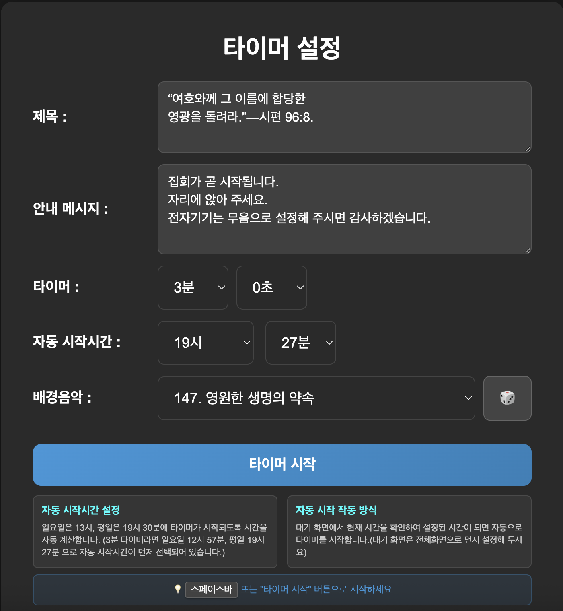
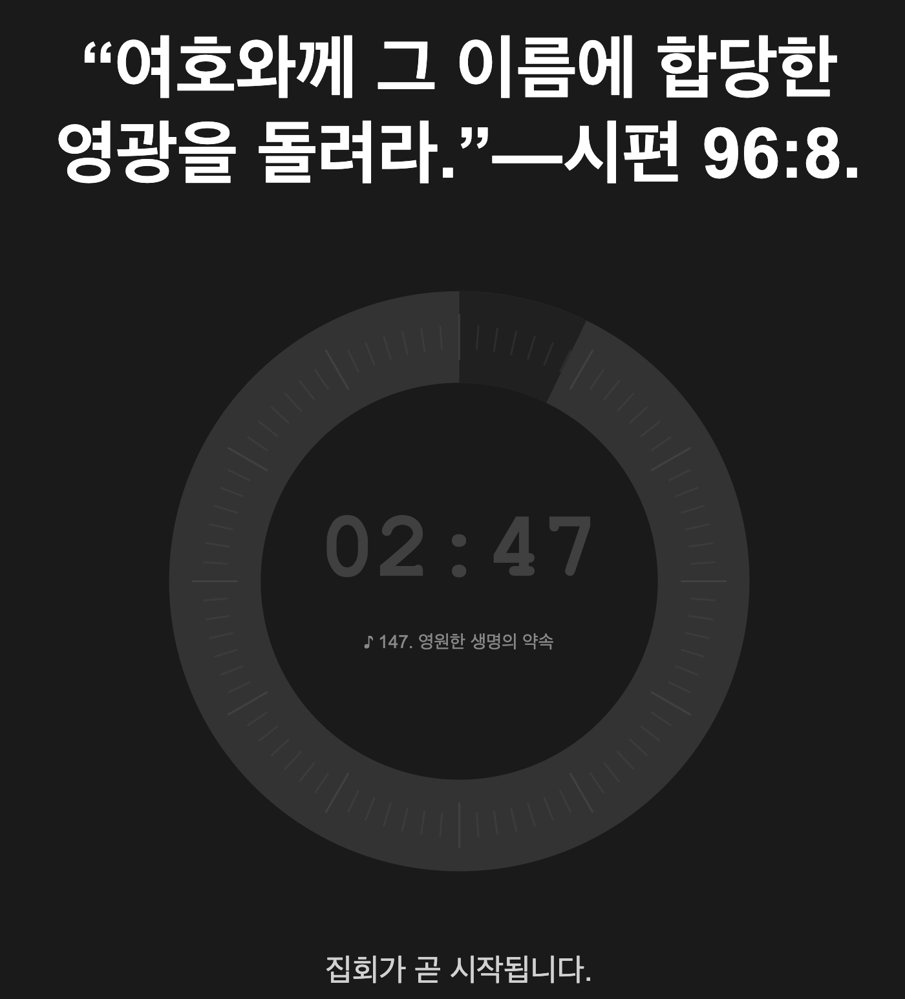

# ⏰ 웹 타이머 애플리케이션

PHP 기반의 강력한 웹 타이머 애플리케이션입니다. 원형 진행바, 배경 음악, 실시간 안내 메시지 등 다양한 기능을 제공합니다.

## 📸 스크린샷

### 설정 화면

*타이머 제목, 시간, 안내 메시지, 배경 음악 등을 설정하는 메인 화면*

### 대기 화면  

*설정된 자동 시작 시간까지 대기하는 화면*

### 타이머 실행 화면

*원형 진행바와 함께 타이머가 실행되는 화면*

## 🚀 주요 기능

### ⏱️ **타이머 기능**
- **원형 진행바**: 시각적으로 아름다운 원형 진행바로 남은 시간 표시
- **정밀한 시간 설정**: 분과 초 단위로 정확한 시간 설정 가능
- **실시간 업데이트**: 1초마다 정확한 시간 업데이트
- **자동 시작**: 설정된 시간에 타이머 자동 실행

### 📢 **안내 메시지 시스템**
- **다중 라인 지원**: 여러 줄의 안내 메시지 입력 가능
- **순차 표시**: 각 메시지가 10초 간격으로 순차적으로 표시
- **페이드 효과**: 부드러운 fade-in/fade-out 애니메이션
- **순환 재생**: 모든 메시지 표시 후 10초 휴식 후 다시 시작
- **실시간 표시**: 타이머 진행 중 화면 하단에 실시간 표시

### 🎵 **배경 음악**
- **온라인 스트리밍**: 외부 URL을 통한 배경 음악 재생
- **JW.org 음악 지원**: 161개의 JW.org 찬양곡 라이브러리 내장
- **자동 재생**: 타이머 시작과 함께 자동 음악 재생
- **볼륨 조절**: 배경 음악 볼륨 조절 가능

### 🖥️ **사용자 인터페이스**
- **반응형 디자인**: 다양한 화면 크기에 최적화
- **전체화면 모드**: F11 키 또는 버튼으로 전체화면 전환
- **실시간 시계**: 현재 시간 표시
- **직관적인 설정**: 사용하기 쉬운 설정 인터페이스

## 📋 시스템 요구사항

- **PHP**: 7.4 이상
- **웹서버**: Apache, Nginx, 또는 PHP 내장 서버
- **브라우저**: Chrome, Firefox, Safari, Edge (최신 버전 권장)

## ⚡ 빠른 시작

### 1. 서버 시작
```bash
# PHP 내장 서버 사용 (개발용)
php -S localhost:8000

# 또는 다른 포트 사용
php -S localhost:3000
```

### 2. 애플리케이션 접속
브라우저에서 `http://localhost:8000` 접속

### 3. 타이머 설정
1. **타이머 제목** 입력
2. **시간 설정** (분, 초)
3. **안내 메시지** 입력 (여러 줄 가능)
4. **배경 음악** URL 입력 (선택사항)
5. **자동 시작 시간** 설정 (선택사항)
6. **타이머 시작** 버튼 클릭

## 🎯 사용 방법

### 📝 **안내 메시지 설정**
```
첫 번째 안내 메시지
두 번째 안내 메시지  
세 번째 안내 메시지
```
- 각 줄에 하나씩 메시지 입력
- 빈 줄은 자동으로 제외됨
- 메시지는 10초 간격으로 순차 표시
- 모든 메시지 표시 후 10초 휴식

### 🎵 **배경 음악 설정**
```
# 직접 URL 입력
https://example.com/music.mp3

# JW.org 음악 사용 (자동 완성)
001  # 1번 찬양곡
010  # 10번 찬양곡
161  # 161번 찬양곡
```

### ⏰ **자동 시작 설정**
- 시간을 `-1:-1`로 설정하면 수동 시작
- `14:30` 형식으로 설정하면 해당 시간에 자동 시작
- 자동 시작 시간은 타이머 시간을 고려하여 자동 계산

### ⌨️ **키보드 단축키**
- **F11**: 전체화면 모드 토글
- **ESC**: 전체화면 모드 종료 (안내 메시지 미표시 시)
- **스페이스바**: 타이머 일시정지/재시작

## 📁 파일 구조

```
timer/
├── index.php           # 메인 설정 페이지
├── timer.php          # 타이머 실행 페이지
├── style.css          # 스타일시트
├── music_list.json    # JW.org 음악 라이브러리
├── timer_settings.json # 타이머 설정 저장 파일
├── screenshot/        # 스크린샷 이미지
│   ├── setting.png    # 설정 화면
│   ├── wait.png       # 대기 화면
│   └── timer.png      # 타이머 실행 화면
└── README.md          # 이 파일
```

## 🎨 주요 특징

### **타이밍 시스템**
- **초기 대기**: 타이머 시작 후 10초 대기
- **메시지 간격**: 각 안내 메시지 간 10초 간격
- **휴식 시간**: 메시지 순환 완료 후 10초 휴식
- **정확한 타이밍**: setInterval과 setTimeout을 활용한 정밀한 시간 관리

### **반응형 UI**
- **모바일 최적화**: 터치 디바이스 지원
- **다크 테마**: 눈에 편안한 어두운 테마
- **부드러운 애니메이션**: CSS 트랜지션과 키프레임 애니메이션

### **데이터 관리**
- **JSON 설정 저장**: 모든 설정이 JSON 파일로 자동 저장
- **세션 백업**: 하위 호환성을 위한 세션 데이터 지원
- **자동 복원**: 페이지 새로고침 시 설정 자동 복원

## 🔧 고급 설정

### **배경 음악 커스터마이징**
`music_list.json` 파일을 수정하여 음악 라이브러리 변경 가능:
```json
{
  "source": "사용자 정의 음악",
  "total_count": 3,
  "songs": [
    {
      "id": 1,
      "title": "음악 제목",
      "url": "https://example.com/music.mp3"
    }
  ]
}
```

### **스타일 커스터마이징**
`style.css` 파일을 수정하여 디자인 변경:
- 색상 테마 변경
- 폰트 크기 조절
- 애니메이션 속도 조절

## 🐛 문제 해결

### **음악이 재생되지 않는 경우**
- HTTPS 환경에서 실행 확인
- 브라우저 자동재생 정책 확인
- CORS 헤더 설정 확인

### **타이머가 정확하지 않은 경우**
- 브라우저 탭이 백그라운드에 있지 않은지 확인
- 시스템 성능 확인

### **전체화면이 작동하지 않는 경우**
- 브라우저 권한 설정 확인
- HTTPS 환경에서 실행 권장

## 📄 라이선스

이 프로젝트는 개인 및 교육 목적으로 자유롭게 사용할 수 있습니다.

## 🔄 업데이트 히스토리

### v2.0 (현재 버전)
- ✅ 다중 라인 안내 메시지 지원
- ✅ 실시간 메시지 순환 시스템
- ✅ 10초 간격 타이밍 통일
- ✅ 향상된 페이드 애니메이션
- ✅ 투명 배경 메시지 표시
- ✅ 개선된 타이머 리셋 로직

### v1.0
- ✅ 기본 타이머 기능
- ✅ 원형 진행바
- ✅ 배경 음악 지원
- ✅ 전체화면 모드

---

🎯 **간단하고 강력한 웹 타이머로 효율적인 시간 관리를 시작하세요!**